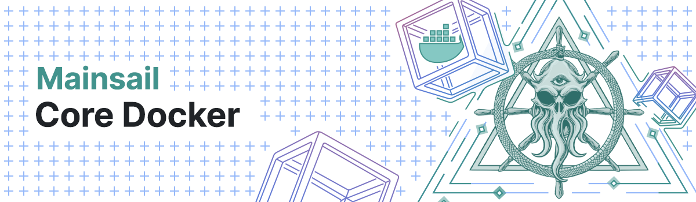
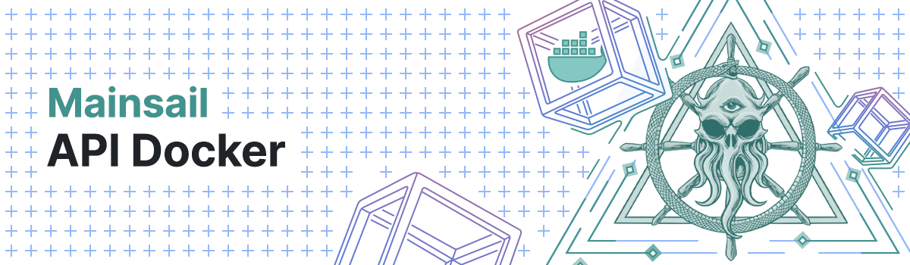

# Mainsail Core Docker

<p align="center">
    
</p>

## Introduction

Mainsail Core Alpha images soon available at [Docker Hub](https://hub.docker.com/r/mainsail/core).

## Documentation

-   https://ark.dev/docs/mainsail

## Mainsail Core Relay

Run Relay only node using [Docker Compose](https://docs.docker.com/compose/)

**_TestNet_**

```bash
cd ~/docker/testnet/core
```

> [!NOTE]
> Please pay attention to the following option in your [`testnet.env`](./core/testnet.env) file!

|`API=false`| Set `API=true` if you intend to run an API server |
|-----------|:--------------------------------------------------|


> _Start_:

```bash
docker-compose up -d
```

> _Monitor_:

```bash
docker logs --tail mainsail-testnet -f
```

> _Stop and remove_:

```bash
docker-compose down -v --rmi all
```
> [!WARNING]  
> If you have set `API=true` Mainsail Core will log errors untill the API container gets up, so you should next proceed with deploying API node.

> [!IMPORTANT]  
> If you prefer to build your own image instead of using our pre-built from [Docker Hub](https://hub.docker.com/r/mainsail/core), then you can proceed as follows:

```bash
cd ~/docker/testnet/core
```
> _Start_:

```bash
docker-compose -f docker-compose-build.yml up -d
```

> _Monitor_:

```bash
docker logs --tail mainsail-testnet -f
```

> _Stop and remove_:

```bash
docker-compose -f docker-compose-build.yml down -v --rmi all
```

# Mainsail API Docker

<p align="center">
    
</p>

## Introduction

Mainsail API Alpha images soon available now at [Docker Hub](https://hub.docker.com/r/mainsail/api).

## Documentation

-   https://ark.dev/docs/mainsail


## Mainsail API node 

Run API node using [Docker Compose](https://docs.docker.com/compose/)

**_TestNet API_**

```bash
cd ~/docker/testnet/api
```

> [!NOTE]
> Please pay attention to the following option in your Mainsail Core [`testnet.env`](./core/testnet.env) file!

|`API=false`| Set `API=true` if you intend to run an API server |
|-----------|:--------------------------------------------------|


> _Start_:

```bash
docker-compose up -d
```

> _Monitor_:

```bash
docker logs --tail mainsail-api-testnet -f
```

> _Stop and remove_:

```bash
docker-compose down -v --rmi all
```
> [!NOTE]
> At this stage your Mainsail Core node should pick up.

```bash
docker logs --tail mainsail-testnet -f
```

> [!IMPORTANT]
> If you prefer to build your own image instead of using our pre-built from [Docker Hub](https://hub.docker.com/r/mainsail/api), then you can proceed as follows:

```bash
cd ~/docker/testnet/api
```
> _Start_:

```bash
docker-compose -f docker-compose-build.yml up -d
```

> _Monitor_:

```bash
docker logs --tail mainsail-api-testnet -f
```

> _Stop and remove_:

```bash
docker-compose -f docker-compose-build.yml down -v --rmi all
```

